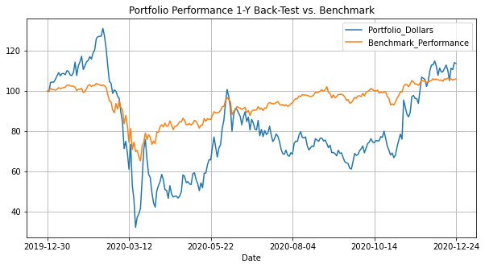

# Growth Portfolio Maker

## Abstract

The financial purpose of this package is to build a portfolio based on the inferred growths using the Gordon Growth 
Model. The package will calculate the growth from the actual market prices along with the cost of capital (calculated
with the ROE) and the annualized dividend for the next year.
The portfolio will **overweight** the stocks with high-growth and **underweight** those with low-growth. The weights are
calculated through **standardization** to build a [Zero-Investment Portfolio](https://www.investopedia.com/terms/z/zero-investment-portfolio.asp), 
which is a hypothetical portfolio which can be built at zero-cost.

## Installation

To build the package download the files and then run the command:

```commandline
python setup.py bdist_wheel
```

This command will build the `.whl` package in the `dist` folder which can then be easily installed using:

```commandline
pip install growth_ptf_maker-1.0.0-py3-none-any.whl
```

Then you're ready to call the package as:

```python
from growth_ptf_maker import PortfolioDashboard
```

## Usage

As a first thing, we will call the class to trigger all the initial operations:

```python
from growth_ptf_maker import PortfolioDashboard

pft_builder = PortfolioDashboard()
```

The package will then:

- Download the dividend data from Dividata.com
- Calculate the Beta
- Calculate the ROE
- Calculate the annualized dividend for the next year
- Download the market data for the last year
- Infer the implied growth
- Calculate the weights of the portfolio

For all the components of the **Dow Jones Industrial Average** (DJIA), as of December 2020, which are:

| Ticker       | Company Name     |
| :------------- | :----------: |
|AMGN|Amgen Inc.|
|DOW|Dow Inc.|
|DIS|The Walt Disney Company|
|NKE|NIKE, Inc.|
|GS|The Goldman Sachs Group, Inc.|
|WMT|Walmart Inc.|
|VZ|Verizon Communications Inc.|
|HON|Honeywell International Inc.|
|MCD|McDonald's Corporation|
|MMM|3M Company|
|AXP|American Express Company|
|JNJ|Johnson & Johnson|
|CSCO|Cisco Systems, Inc.|
|TRV|The Travelers Companies, Inc.|
|HD|The Home Depot, Inc.|
|CVX|Chevron Corporation|
|JPM|JPMorgan Chase & Co.|
|MRK|Merck & Co., Inc.|
|WBA|Walgreens Boots Alliance, Inc.|
|IBM|International Business Machines Corporation|
|CAT|Caterpillar Inc.|
|KO|The Coca-Cola Company|
|CRM|salesforce.com, inc.|
|AAPL|Apple Inc.|
|MSFT|Microsoft Corporation|
|UNH|UnitedHealth Group Incorporated|
|PG|The Procter & Gamble Company|
|INTC|Intel Corporation|
|BA|The Boeing Company|
|V|Visa Inc.|

`pft_builder` will then contain the results of all the operations described above.

### Modules

Initially, I have only implemented three modules:

- back_test_results()
- risk_metrics()
- analytics()

Let's dig them out...

#### back_test_results()

This module will include a DataFrame with all the results of the back-test. The back-test window is 1 year.
The DataFrame includes all the **weighted** daily returns for the last year for all the DJIA components. All these
returns are then multiplied (row by row) to compute the return of the Portfolio.
I have then simulated the return of $100 invested one year ago, with the weights of today, and stored the results in the 
_Portfolio_Dollars_ column.

#### risk_metrics()

This module calculates some well-known risk indicators, like **VaR** and **Expected Shortfall**.
Specifically, the script calculates:
1. VaR-95%
2. VaR-99%
3. HVaR-95%
4. HVaR-99%
5. ES-97.5%
6. Minimum
7. Min-Max Range

These metrics are useful to assess the riskiness of the portfolio and to compare it with other portfolios or the market 
itself.

#### analytics()

Finally, this is the last module which stores some analytics of the portfolio in the form of chart.
Each chart is calculated _on-the-fly_, meaning that the package stores the code in a function and then in a dictionary
and when the user calls the function the package builds the chart automatically.
Just to give some context, let's see how we can pull up the last year performance for the portfolio:

```python
from growth_ptf_maker import PortfolioDashboard

pft_builder = PortfolioDashboard()

pft_builder.analytics()
```

Will return something like:

```text
{'performance': <bound method PortfolioAnalytics.__calculate_performance of <growth_ptf_maker.portfolio_analytics.PortfolioAnalytics object at 0x7fb633d06f10>>,
 'performance_vs_benchmark': <bound method PortfolioAnalytics.__calculate_performance_vs_benchmark of <growth_ptf_maker.portfolio_analytics.PortfolioAnalytics object at 0x7fb633d06f10>>,
 'excess_growth': <bound method PortfolioAnalytics.__analyze_excess_growth of <growth_ptf_maker.portfolio_analytics.PortfolioAnalytics object at 0x7fb633d06f10>>,
 'growth_rates_comparison': <bound method PortfolioAnalytics.__compare_growth_rates of <growth_ptf_maker.portfolio_analytics.PortfolioAnalytics object at 0x7fb633d06f10>>,
 'weights': <bound method PortfolioAnalytics.__show_weights of <growth_ptf_maker.portfolio_analytics.PortfolioAnalytics object at 0x7fb633d06f10>>}
```

This method has 5 charts to show:
1. Performance
2. Performance vs. Benchmark
3. Excess Growth
4. Growth Rates Comparison
5. Weights

If we want to, for example, see the performance of the constructed portfolio against the benchmark, we will then do:

```python
from growth_ptf_maker import PortfolioDashboard

pft_builder = PortfolioDashboard()

pft_builder.analytics()["performance_vs_benchmark"]()
```

This will be the result:



# Contacts

If you have any feedback or suggestion on this or other packages feel free to comment or write it to me!